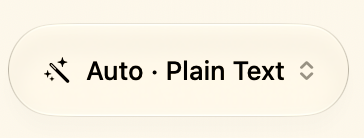
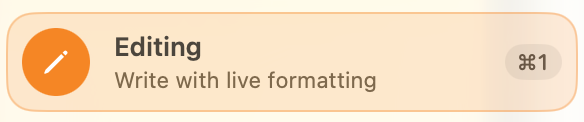
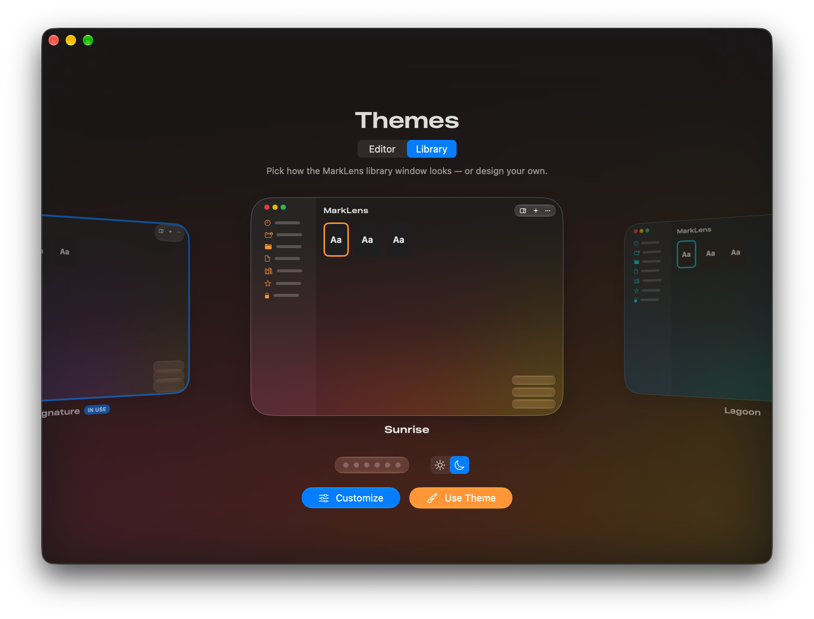
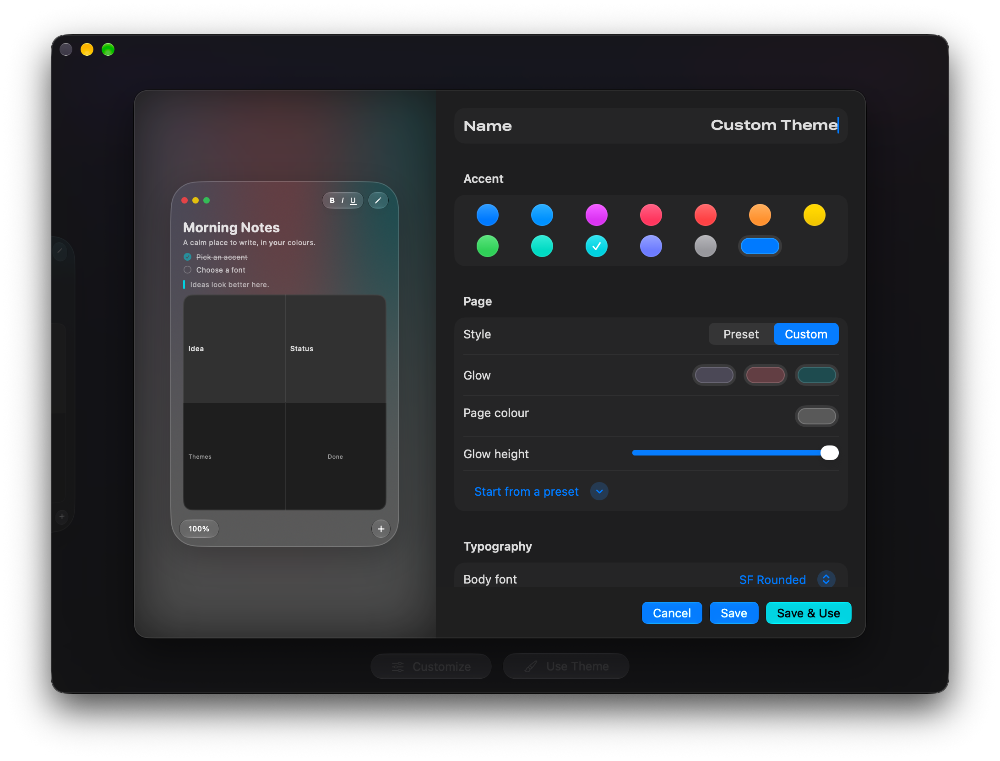
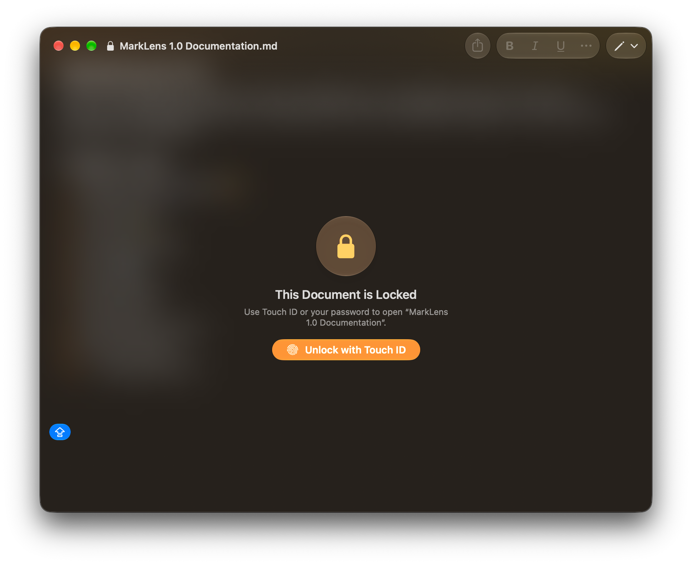
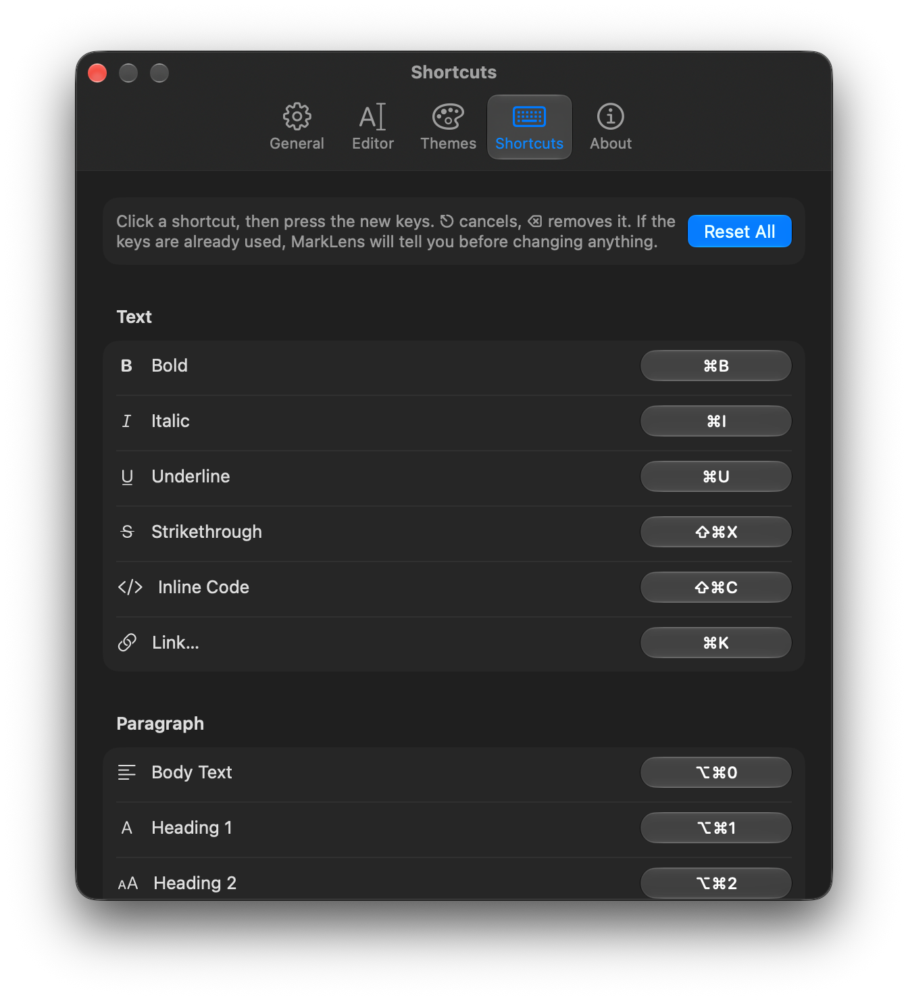
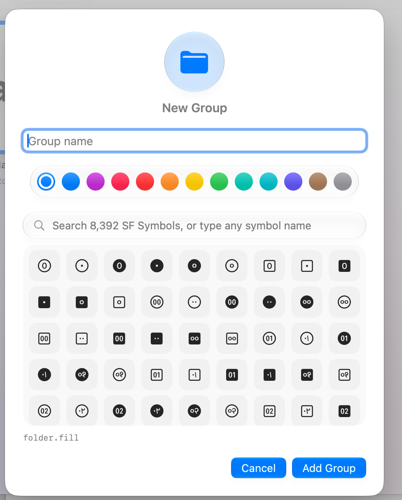
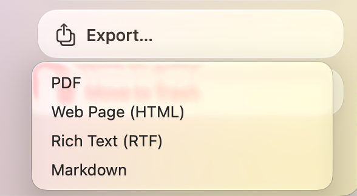
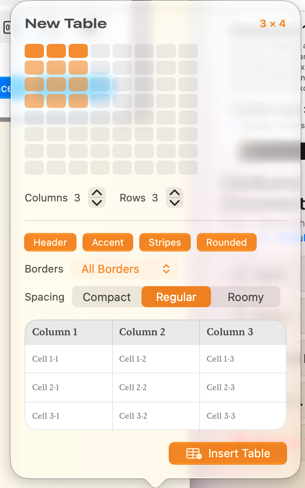

# MarkLens 1.0

We are so thankful and thrilled to announce MarkLens 1.0, A markdown editor with minimal distraction and Maximum Features. This app is free and uses Markdown Engine to convert Normal documents to Markdown

## Update Logs :

1. Multiple Themes options 🎨
2. Theme Creator
3. Lock Files 🔒
4. Shortcuts Customization 􀆔
5. Groups 📂
6. Export Options 􀈃
7. Table Customization 􀏤
8. Smart Code Blocks 􀪏

1. Auto Formatting 􀆿

1. Easy Installation 􀈅

## Images :

